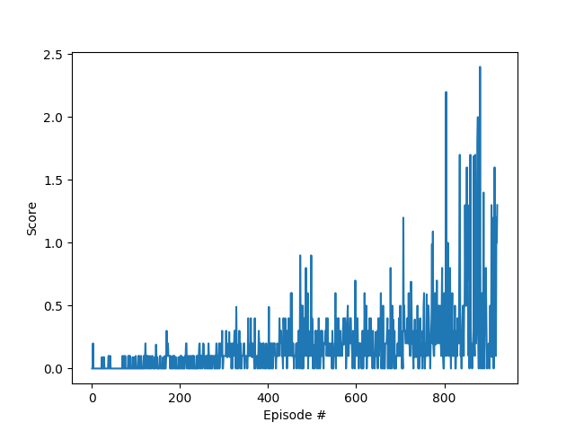

## Learning Algorithm
The algorithm can run in two modes, trained and untrained.

In the **trained mode** two agents are loaded and interact with the environment. During the interaction there is no learning taken place, and it is used as a demonstration of its capabilities.

In the **untrained mode** the agents learn a new task, consisting in playing with the rackets bouncing a ball over a net. The agents were created implementing a modification of DDPG based on the code provided by Udacity ([ddpg-pendulum](https://github.com/udacity/deep-reinforcement-learning/tree/master/ddpg-pendulum)) and adapted to this environment. In this solution the agents share a replay buffer and a critic, being the actors independent.

Each agent contains an actor and a critic, and each of them makes usage of two neural networks, the local ad the target. The actor models contain two fully-connected layers of 256 and 128 units activated by the relu function and an output layer of 1 unit activated by the tanh function. The critic models contain two fully-connected layers of 400 and 300 units respectively activated by the relu function, and an output layer. The agents use a shared replay buffer to train the networks.

When the agents receive the state of the environment they uses their local network of the actors to choose the action to take by each arm, and includes some noise that ensures some exploration. The actions are sent to the environment, that returns the rewards, new states and the status of the episode (finished or not). The agents stores the experiences (states, actions, rewards, next states and episode status) in the replay buffer. In each episode the agents enter in the 'learn' phase.

During the learn phase **each agent** randomly selects 128 experiences, the actor uses them to estimate the next actions using it's target model and the common critic uses the 128 experiences and the next actions from the actor to obtain a target Q with the target network. To obtain the target Q the discount factor is set to 0.99. The common critic uses its local model to obtain the expected Q and, with both Qs, computes the loss using ADAM to update its local model.

Once the common critic is updated, it's the turn for the actor. The actor uses its local model to predict actions, and the local model of the common critic to estimate the loss. This loss is used by the actor to finally update it's local network using ADAM.

With the local networks of both, actor and critic, already updated, it's the turn for the target models of both the actor and the critic. Both target networks softly update the weights to be 0.001 times the weights of the local network and 0.999 times the  weights of the target network. As mentioned before, this process is done by **each agent**.

This approach solves the problem in 600-900 episodes. Another solutions that were tested with worst results are:
* Update the weights every 4 steps. Updating every step is stable enough.
* Use a non-normal (linear) noise. Produces too much exploration.
* Use deeper or simpler models.
* Use a much bigger (1024 instead of 128) number of experiences to learn. The learning takes longer to happen the first time and the increment on experiences doesn't compensate it.

## Rewards
The graph below shows the average score obtained after each episode using the last 100 episodes. The agent solves the environment in less than 900 episodes, although in different executions the number varies, obtaining a best result of 636 episodes.

## Ideas For Future Work
There are some additions that can be implemented to improve the algorithm, highlighting prioritized replay, that is the next one to be included trying to speed up the training.
